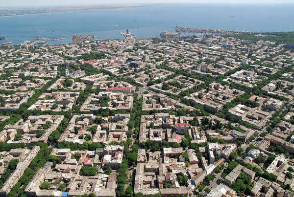

# Старт

Плюс HTML'я в том, что Вы можете начать очень быстро. Если Вы работаете на Windows, щелкните правой клавишей на свободном месте, выберете "Создать текстовый файл". Далее щелкните правой клавишей на созданном файле и переименуйте его в index.html .

```!!! Не забудьте включить себе отображение расширений файлов!!!```

Откройте созданный файл в блокноте и скопируйте туда следующие строки

```html
<html>
<head>
</head>
<body>
	Hello World!
</body>
</html>
```

Сохраните и откройте данный файл в браузере. На экране Вы должны увидеть Hello World! Если это так - поздравляю - Вы создали свой первый сайт.

Я рекомендую Вам установить себе текстовый редактор с подсветкой, например [Sublime Text](http://www.sublimetext.com/3). Этому редактору можно посвятить отдельную книгу, но в целом его интерфейс интуитивно понятен. Можете также заглянуть в эту [шпаргалку](https://learn.javascript.ru/sublime).

Теперь вернемся к нашему коду и рассмотрим его подробнее. HTML использует теги - слова заключенные в такие скобки &lt;&gt;. Есть открывающие теги, например &lt;html&gt; и закрывающие &lt;/html&gt; - такие теги называют парными. Есть теги непарные, например тег &lt;img&gt; - у него нет закрывающего

То, что мы показываем пользователю в качестве страницы находится в теге <body>. Давайте добавим туда картинку. Для этого заходим в Гугл, набираем Одесса(или другой город, но зачем он Вам нужен!? :) и сохраняем понравившуюся картинку, под названием odessa.jpg.

Пока что картинка должна быть в той же папке, что и наш файл index.html . Добавлем в код, после тега &lt;body&gt; &lt;img src="odessa.jpg"&gt;


```html
<html>
<head>
</head>
<body>
	Hello World!
	
	
</body>
</html>
```

И получаем следующую картинку

Hello World!


Теперь давайте добавим в наш код гиперссылку

```html
<html>
<head>
</head>
<body>
	Hello World!
	
	
	
	<a href="http://google.com">Ссылка на Гугл</a>
</body>
</html>
```

**Внутренние и внешние ссылки**

Можно ставить ссылку не только на внешний ресурс, но и на другую страницу сайта. Для этого в атрибуте href необходимо указать название файла, на который мы хотим сослаться.

```html
<A href="http://google.com">Ссылка на Гугл</A>
```
Гиперссылки можно разделить на внешние(ведущие на другие сайты) и внутренние(которые ссылаются на другие страницы этого же сайта)

**Абсолютная и относительная адресации**

Когда мы ссылаемся на файлы нашего сайта мы в теории можем применить как абсолютную адресацию (пути, которые начинаются от корневого диска, например C:\Projects\index.html) так и относительную(пути, которые выстраиваются относительно нашей текущей папки)


**Локальные ссылки, атрибут name**

Мы можем ссылаться на разные части одной и той же страницы, например https://ru.wikipedia.org/wiki/%D0%9E%D0%B4%D0%B5%D1%81%D1%81%D0%B0#%D0%98%D1%81%D1%82%D0%BE%D1%80%D0%B8%D1%8F

Для этого нам нужно сформировать место, куда мы будем переходить на странице, через атрибут name тега a

```html
<a name="user_label"></a>
```
А в дальнейшем мы можем сослаться на нее через символ #

```html
<a href="#user_label">Ссылка на локальную метку</a>
```

**Атрибут target у ссылок**

Если мы хотим сделать ссылку, которая бы открывала страницу в новом окне, нам необходимо использовать атрибут target со значением _blank

```html
<A href="http://google.com" target="_blank">
Открыть Гугл в новом окне
</A>
```


**Практика:**

1. Вам нужно сделать два файла, в первом ссылку на второй, во втором ссылку на первый
2. Сделать три страницы. Вверху каждой страницы добавить навигационное меню с ссылками на каждую из страниц.
3. Сделать файл с галереей из трех картинок. При клике на картинку переходим на страницу, в которой показывается увеличенная копия картинки.
4. Сделать страницу высотой в несколько экранов(большие картинки с заголовками перед ними). Вверху страницы добавить навигационное меню по странице.