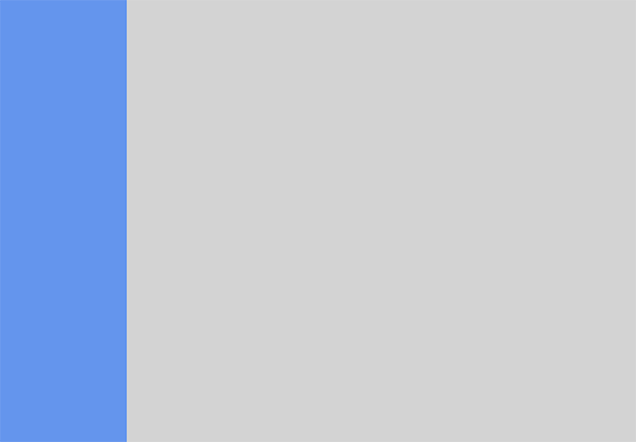
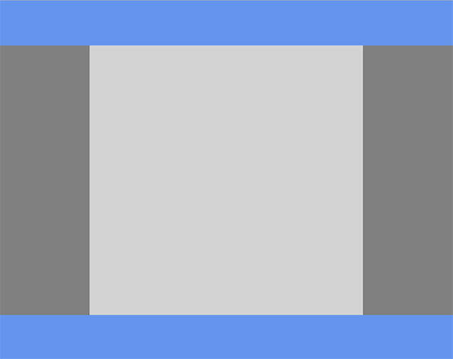
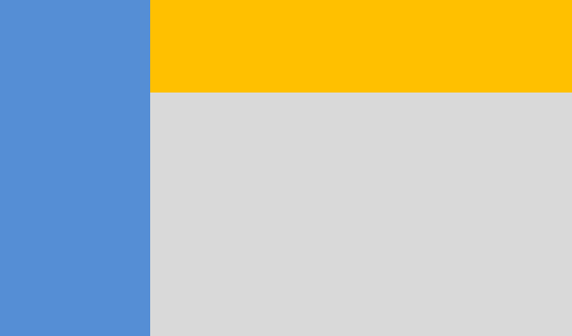

# Строчные и блочные элементы

Давайте для начала научимся применять CSS-свойства к тегам. Для этого нам понадобится атрибут style. HTML и CSS должны быть разделены, но на данный момент нам нужно разобратьхотя бы несколько CSS-свойств. В дальнейшем мы научимся выносить CSS в отдельный файл

Построим блок

```html
<div style="width:200px;height:100px;background-color:red">
</div>
```

За счет атрибута style мы применили CSS-свойства к тегу div. width - задает ширину блока в 200 пикселей, height- высоту в 100 пикселей, background-color - делает фон красным. Все CSS-свойства отделяются друг от друга точкой с запятой.

Если все пройдет хорошо, нам выведется красный прямоугольник.

Попробуйте сделать еще один прямоугольник с другими размерами и фоном самостоятельно.

Обратите внимание, что блоки каждый раз выводятся с новой строки.

**Строчные и блочные элементы**

Сделаем страницу с двумя блоками и двумя картинками подряд

```html
<html>
<body>
<div style="width:200px;height:100px;background:red">
</div>
<div style="width:300px;height:150px;background:green">
</div>


</body>
</html>
```

Обратим внимание на то, что получилось  
Блоки отобразились каждый с новой строки, а картинки расположились в одну строчку. Почему так происходит?  
Различие проистекает из того, что есть блочные и строчные элементы. Давайте разберёмся подробнее.

Тег &lt;div&gt; - является блочным элементом, а блочные элементы:  
1. добавляют перенос до и после себя  
2. если ширина не задана через свойство width, получают ширину 100%, то есть на весь экран.

Тег &lt;span&gt; - является строчным. Строчные располагаются в линию, что можно понять  из их названия. Если места в строке нет, то они переносятся на следующую строчку.

Важный момент: у строчных элементов нет размеров. Легче всего это представить можно на примере воды. Какие размеры у литра воды? Это зависит от того, куда Вы ее нальете. Так и размеры строчных элементов ограничены внешними блоками.

Сам по себе тег &lt;span&gt; ничего не делает. Возникает вопрос зачем он вообще тогда нужен? Допустим, мы хотим добавить оформление к тексту. Но чтобы добавить CSS нам нужен тег. Вот тут то нам и поможет &lt;span&gt;

```html
Мы можем сделать этот текст <span style="color:red;">красным</span>.
```

Давайте теперь вернемся к картинкам\(теги &lt;img&gt;\) - с одной стороны они имеют размеры, как блочные элементы, с другой они располагаются в строчку. Это происходит, потому что они являются **inline-block** элементами.

**Свойство display**

Свойство display позволяет изменить "строчность" или "блочность" элемента

```css
display:block; //делает элемент блочным, как<div>
display:inline-block; //делает элемент строчно-блочным как 
display:inline;   //делает элемент строчным как <span>
```

Давайте попробуем поставить для одного из div'ов свойство display:inline

Если Вы все сделали правильно Ваш блок должен пропасть:\) Почему? Помните - строчные блоки не имеют размеров.

Чтобы исправить ситуацию давайте поставим блокам свойство display:inline-block; При этом и картинки и блоки должны отобразиться в одну строчку, если у Вас хватает места.

**Пробелы между display:inline-block; элементами**

Если мы сделаем два блока \(например квадраты\) и поставим им свойство display:inline-block, то скорее всего между ними будет отступ

```html
<div style="width:100px;height:100px; background-color:red;display:inline-block;">
</div>
<div style="width:100px;height:100px; background-color:blue;display:inline-block;">
</div>
```

Отступ появляется из-за того, что символ переноса строки между блоками превращается в браузере в пробел. Если мы избавимся от него - то все будет отлично.

```html
<div style="width:100px;height:100px; background-color:red;display:inline-block;">
</div
><div style="width:100px;height:100px; background-color:blue;display:inline-block;">
</div>
```

Во втором примере перенос находится внутри тега и игнорируется браузером.

**Принудительный перенос &lt;br&gt;**

Для того, чтобы сделать принудительный перенос строки можно использовать тег &lt;br&gt;

**Практика:**  
1. Создаем сайт на весь экран\(ширину задаем в процентах, например width:70%\) с двумя блоками \(сайдбар - боковой блок, контент - основной блок\)  

2. Превращаем гиперссылку в прямоугольник(задаем ширину и высоту)  
2. Создание шахматной доски 3x3  
3. Навигационное меню сверху. Далее три колонки на весь экран  
  
4. Три картинки в ряд. Между ними отступы. Шаблон занимает весь экран  
5. Создаем резиновый сайт\(на всю ширину экрана\) с тремя блоками \(см рисунок\)  


