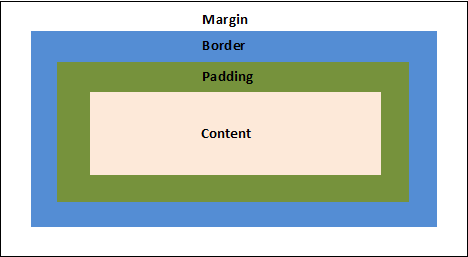

# Отступы



**Padding** – «внутренний» отступ(выводится внутри границы). На padding распространяется цвет фона контента. Ширина padding’a добавляется к ширине и высоте контента

Мы можем задавать padding множеством способов
```css
padding: 25px 50px 75px 100px;
```
верхний padding равен 25px
padding справа равен 50px
bottom снизу равен 75px
padding слева равен 100px

```css
padding: 25px 50px 75px;
```
top padding is 25px
right and left paddings are 50px
bottom padding is 75px

```css
padding: 25px 50px;
```
top and bottom paddings are 25px
right and left paddings are 50px

```css
padding: 25px;
```
all four paddings are 25px
Мы можем задавать padding отдельно по направлениям
padding-bottom
Устанавливает padding снизу
padding-left
Устанавливает padding слева
padding-right
Устанавливает padding справа
padding-top
Устанавливает padding сверху


**Margin**

margin – внешний отступ(делает отступ снаружи границы). Margin всегда прозрачен
Правила использования margin’a, аналогичны padding’у – просто слово padding меняется на margin


margin:0px; у body убирает белые отступы по краям документа

margin:0 auto; – выравнивает блок по середине

**Границы**

border: 3px solid black;
border-width:3px;
border-style:solid;
border-color:red;

Мы можем задавать границу отдельно по направлениям
border-top
border-bottom-style

outline – граница выделения


Практика:
1) Сделать один блок под другим. Между ними сделать расстояние высотой в один блок. Оба блока должны быть выровнены по центру
