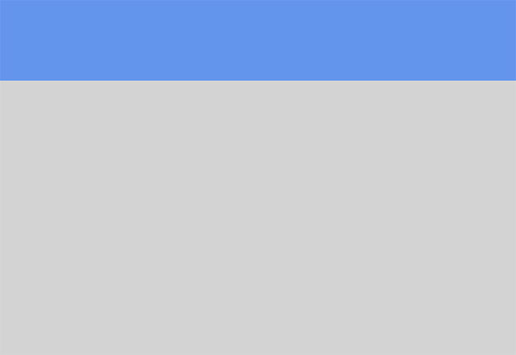

# Адаптивная верстка

Наш сайт может оказаться на совершенно различных устройствах: компьютеры, телевизоры, ноутбуки, планшеты, мобильные.
Конструкция  media позволяет подключать различные участки CSS, для различных ситуаций

Допустим у нас есть блок с таким оформлением

```css
.block {
     width:200px;
     height:200px;
     background:cornflowerblue;
}
```

Мы хотим чтобы при сужении блок поменял цвет. Для этого добавим в код media-запрос

```css
.block {
     width:200px;
     height:200px;
     background:cornflowerblue;
}

@media (max-width:800px) {
     .block {
         background:red;
     }
}
```

то есть наш media-запрос не будет работать пока ширина экрана не станет меньше 800. Когда media-запрос выполнился, для браузера наш css будет выглядеть следующим образом.

```css
.block {
     width:200px;
     height:200px;
     background:cornflowerblue;
}

.block {
    background:red;
}
```

Мы можем усложнить условия media-запросов

**Логическое И**

Допустим мы хотим, чтобы в нашем примере блок при ширине окна от 900px до 1000px был фиолетовым. Для этого нам нужно добавить еще один media-запрос. Да в одном файле может быть сколько угодно media-запросов!

Посколько у нас два условия: ширина окна должна быть больше 900px и меньше 1000px - нам понадобится логическое "И". Чтобы задать оператор "И" в выражении нужно использовать слово *and*

```css
.block {
     width:200px;
     height:200px;
     background:cornflowerblue;
}

@media (max-width:800px) {
     .block {
         background:red;
     }
}

@media (min-width:900px) and (max-width:1000px) {
     .block {
         background:red;
     }
}
```

**ИЛИ**

Иногда нужное нам оформление должно работать в двух разнородных промежутках. Чтобы объединить промежутки мы можем использовать оператор "ИЛИ". В media-запросе используется запятая.

Условие ниже будет срабатывать если ширина окна меньше 600px и больше 800px

```css
@media (max-width: 600px), (min-width: 800px) {
  html { background: red; }
}
```

**Усложнение конструкций**

Внутри одного media-запроса может быть сколько угодно CSS-селекторов.

```css

@media (min-width:800px) {
     :root {
          color:black;
     }

     .block {
          width:100px;
     }
}

```

**Подключение через link**

Мы можем писать media-запросы непосредственно в теге link при подключении css-файлов. Но такой подход заставит нас разбивать наш css на множество файлов

```html
<link rel="stylesheet" media="(max-width: 800px)" href="example.css" />
```

**Различные типы устройств**

_braille_ – Для устройств системы Брайля для слепых людей. (Пример 1 | Пример 2)

_embossed_ – Для идеи будущего, известной как выпуклые экраны. (Патент | Экспериментирование)

_handheld_ – Для телефонов, карманных компьютеров и других небольших устройств.

_print_ – Для принтеров.

_projection_ – Для мелко- и крупномасштабных проекторов.

_screen_ – Наиболее распространенный тип. Для всех устройств, имеющих экраны.

_speech_ – Для устройств, воспроизводящих речь. (Пример)

_tty_ – Для телекоммуникационных устройств для глухих. (Пример)

_tv_ – Для телевизоров.

Например мы можем задать особенное оформление для сайта при печати

```css
@media print {

}
```

Или даже отдельное оформление для цветного принтера

```css
@media (max-color: 4) {
     body {
          background-image: none;
     }
}
```


**Учет плотности пикселей на устройстве**

```css
@media print and (min-resolution: 300dpi) { ... }
```

**CSS-шлюзы**

https://habrahabr.ru/company/mailru/blog/315196/

**Дополнительные ссылки:**

1. PX, EM or REM Media Queries?
http://zellwk.com/blog/media-query-units/

2. Managing Media Queries
https://medium.com/@AshConnolly/managing-media-queries-ac2205d1a926#.z21akyckz

3. Очень хороший обзор различных возможностей media-запросов https://webformyself.com/media-zaprosy-obzor-razlichnyx-vozmozhnostej/


**Практика:**

1. Изменение цвета блока при сужении
2. Делаем несколько промежутков. В каждом промежутке блок принимает свой цвет.
3. Изменение фоновой фотографии с горизонтальной на вертикальную при сужении
4. Меняем горизонтальное меню на вертикальное при сужении
5. Есть боковая колонка и блок контента. При сужении боковая панель должна переместиться на верх шаблона

<BR>
6. Предыдущее задание, но боковая панель находится справа.
7. Три коллонки. Одна фиксированная. Две резиновые. У одной из резиновых есть min-width. Добиться, чтобы при любом разрешении сумма ширин колонок была 100%.
8. Многоколоночная адаптивная галерея. Сначала у нас 4-ре колонки, потом три, потом две, потом одна. Все фотографии должны отображаться на весь экран. 
9. Создание адаптивного шаблона
 

