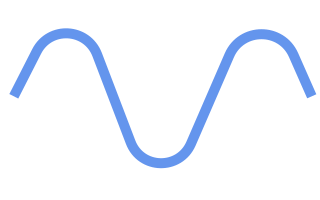

# SVG


**Работа с простейшими фигурами**

Давайте создадим наш первый SVG

```html
<svg version="1.1" xmlns="http://www.w3.org/2000/svg"   width="320" height="200">
<circle cx="250" cy="25" r="25"/>
</svg>
```

В результате получим черный круг размером 50 на 50px

Добавим к кругу характеристики

```html
<svg xmlns="http://www.w3.org/2000/svg" width="500" height="50">
  <circle cx="250" cy="25" r="25" fill="yellow" stroke="orange"/> 
</svg>
```

Мы можем также воздействовать на отдельные элементы с помощью CSS

```html
<svg width="500" height="50">
  <circle cx="250" cy="25" r="25" class="pumpkin"/> 
</svg>
```

Но в CSS у нас выносятся SVG-свойства

```css
.pumpkin {
    fill: yellow;
    stroke: orange;
    stroke-width: 5;
 }
```

результат

```html
<svg version="1.1" xmlns="http://www.w3.org/2000/svg" xmlns:xlink="http://www.w3.org/1999/xlink"  width="320" height="220">
	<style>
	.pumpkin {
		fill: yellow;
	    stroke: orange;
	    stroke-width: 5;
	}	
		
	</style>	

	<circle cx="250" cy="25" r="25" class="pumpkin"/>
</svg>
```

**path**

path - замечательная вещь, которая позволит нам делать ломанные и кривые



Код этой кривой
```html
<svg version="1.1" xmlns="http://www.w3.org/2000/svg"   width="320" height="200">

	<path d="M311.75 96.29C302.06 74.33 296 60.6 293.58 55.11C281.23 27.15 241.52 27.27 229.34 55.31C215.31 87.63 205.06 111.24 191.01 143.59C179.37 170.39 141.07 169.54 130.64 142.24C118.61 110.78 109.56 87.09 97.15 54.63C86.9 27.8 49.69 25.83 36.66 51.43C33.61 57.41 26 72.36 13.81 96.29" id="wave" opacity="1" fill-opacity="0" stroke="cornflowerblue" stroke-width="10" stroke-opacity="1">
	</path>
</svg>
```

Но пока что рассмотрим пример по проще.

```html
<svg xmlns="http://www.w3.org/2000/svg"  height="210" width="400" >
<path d="M150 0 L75 200 L225 200 Z" />
</svg> 
```

Данный пример создаст треугольник

M 150 0 - означает перейти в точку 150 0  

L 75 200- нарисовать линию от предыдущей точки (у нас это 150 0), в точку 75 200  

L 225 200 - еще одна линия (линии всегда рисуются от предыдущей точки, поэтому задается только одна новая точка)  

Z - замыкает наш треугольник 

**Полезное чтиво:**

1. Описание синтаксиса линий
http://www.w3schools.com/graphics/svg_path.asp

2. Подробное описание
https://developer.mozilla.org/ru/docs/Web/SVG/Tutorial/Paths

3. Просто хорошее описание
http://css.yoksel.ru/svg-path/

**Движение по кривой**


Рассмотрим код кривой приведенной ниже

```html
<svg xmlns="http://www.w3.org/2000/svg" xmlns:xlink="http://www.w3.org/1999/xlink" width="320" height="200">

	<path d="M311.75 96.29C302.06 74.33 296 60.6 293.58 55.11C281.23 27.15 241.52 27.27 229.34 55.31C215.31 87.63 205.06 111.24 191.01 143.59C179.37 170.39 141.07 169.54 130.64 142.24C118.61 110.78 109.56 87.09 97.15 54.63C86.9 27.8 49.69 25.83 36.66 51.43C33.61 57.41 26 72.36 13.81 96.29" id="wave" opacity="1" fill-opacity="0" stroke="cornflowerblue" stroke-width="10" stroke-opacity="1">
	</path>

	<circle id="circle" r="20" cx="0" cy="0" fill="cornflowerblue"></circle>

	<animateMotion xlink:href="#circle" dur="5s" begin="0s" fill="freeze" repeatCount="indefinite" keyPoints="1;0" keyTimes="0;1">
	<mpath xlink:href="#wave"></mpath>
	</animateMotion>
</svg>
```


http://primat.org/news/svg_animacija_dvizhenie_po_krivoj/2016-03-25-1162

**defs. Формирование заготовок**

Сделаем так, чтобы круг по прежнему двигался по траектории, но линия траектории была не видна. Для этого нам понадобится тег def, который позволяет формировать заготовки.


Поместим  наш path в defs, таким образом path будет существовать, но уже не будет виден пользователю. 

```html
<svg version="1.1" xmlns="http://www.w3.org/2000/svg" xmlns:xlink="http://www.w3.org/1999/xlink"   width="320" height="200">
	<defs>
	<path d="M311.75 96.29C302.06 74.33 296 60.6 293.58 55.11C281.23 27.15 241.52 27.27 229.34 55.31C215.31 87.63 205.06 111.24 191.01 143.59C179.37 170.39 141.07 169.54 130.64 142.24C118.61 110.78 109.56 87.09 97.15 54.63C86.9 27.8 49.69 25.83 36.66 51.43C33.61 57.41 26 72.36 13.81 96.29" id="wave"></path>
	</defs>
	
	<circle id="circle" r="20" cx="0" cy="0" fill="cornflowerblue"></circle>

	<animateMotion xlink:href="#circle" dur="5s" begin="0s" fill="freeze" repeatCount="indefinite" keyPoints="1;0" keyTimes="0;1">
	<mpath xlink:href="#wave"></mpath>
	</animateMotion>
</svg>
```
Обратите внимание, что path c id="wave", хоть и не виден пользователю, но по прежнему используется в анимации, где mpath ссылается на него через xlink:href

**use. Использование заготовок**

Что если мы хотим оставить заготовку в defs и использовать её много раз, но при этом хотим всё-таки видеть путь по которому движется круг. Для этого можно использовать use.


Рассмотрим пример ниже

```html
<svg version="1.1" xmlns="http://www.w3.org/2000/svg" xmlns:xlink="http://www.w3.org/1999/xlink"   width="320" height="200">
	<defs>
	<path d="M311.75 96.29C302.06 74.33 296 60.6 293.58 55.11C281.23 27.15 241.52 27.27 229.34 55.31C215.31 87.63 205.06 111.24 191.01 143.59C179.37 170.39 141.07 169.54 130.64 142.24C118.61 110.78 109.56 87.09 97.15 54.63C86.9 27.8 49.69 25.83 36.66 51.43C33.61 57.41 26 72.36 13.81 96.29" id="wave"></path>
	</defs>
	<use xlink:href="#wave" opacity="1" fill-opacity="0" stroke="cornflowerblue" stroke-width="10" stroke-opacity="1"></use>

	<circle id="circle" r="20" cx="0" cy="0" fill="cornflowerblue"></circle>

	<animateMotion xlink:href="#circle" dur="5s" begin="0s" fill="freeze" repeatCount="indefinite" keyPoints="1;0" keyTimes="0;1">
	<mpath xlink:href="#wave"></mpath>
	</animateMotion>
</svg>
```

Обратите внимание, что use в коде не только подключает наш path, но и добавляет к нему оформление. То есть мы можем получать много разных вариантов наших заготовок (в разном цвете и разных размерах)

**g. Группировка**

Теперь допустим мы хотим, чтобы у нас было несколько элементов с анимацией. Чтобы не дублировать код, мы можем объединить линию, круг и всю сопутствующую анимацию в одну группу, с помощью тега g. Группу поместить в defs, чтобы она нам не мешала. И в дальнейшем с помощью use сделать необходимое количество копий с нужным нам расположением.


```html
<svg version="1.1" xmlns="http://www.w3.org/2000/svg" xmlns:xlink="http://www.w3.org/1999/xlink"   width="320" height="300">
  
	<defs>
		<g id="pipe">
		    <path d="M311.75 96.29C302.06 74.33 296 60.6 293.58 55.11C281.23 27.15 241.52 27.27 229.34 55.31C215.31 87.63 205.06 111.24 191.01 143.59C179.37 170.39 141.07 169.54 130.64 142.24C118.61 110.78 109.56 87.09 97.15 54.63C86.9 27.8 49.69 25.83 36.66 51.43C33.61 57.41 26 72.36 13.81 96.29" id="wave" opacity="1" fill-opacity="0" stroke="cornflowerblue" stroke-width="10" stroke-opacity="1"></path>

			<circle id="circle" r="20" cx="0" cy="0" fill="cornflowerblue"></circle>
	
		    <animateMotion xlink:href="#circle" dur="5s" begin="0s" fill="freeze" repeatCount="indefinite" keyPoints="1;0" keyTimes="0;1">
				<mpath xlink:href="#wave"></mpath>
			</animateMotion>

		</g>
	</defs>
   
    <use xlink:href="#pipe" ></use>

    <use xlink:href="#pipe" x="0" y="100"></use>
</svg>
```

**Полезное чтиво:**

1. _Тэг &lt; defs&gt;_
http://tutorials.jenkov.com/svg/defs-element.html

2. _Тэг &lt; g>_  
https://sarasoueidan.com/blog/structuring-grouping-referencing-in-svg/

3. use  
http://tutorials.jenkov.com/svg/use-element.html

**Работа с текстом**

https://developer.mozilla.org/ru/docs/Web/SVG/Element/textPath

http://vanseodesign.com/web-design/svg-text-on-a-path-part-1/

```html
<svg width="660" height="220" style="outline: 1px solid red; font-size: 2em; overflow: visible;">

  <defs>  
    <path id="text-path" d="M225,150 v-80 h240 v80 Z" />  
  </defs>

  <text>  
    <textPath xlink:href="#text-path" >SVG text on a linear path</textPath>  
  </text>

</svg>
```

Примеры текстовых эффектов на SVG
https://codepen.io/collection/DPYwYN/2/

**clip-path**


**Полезное чтиво:**

1. О clip-path
https://www.sarasoueidan.com/blog/css-svg-clipping/

2. Вырезания и маски
https://css-tricks.com/clipping-masking-css/

3. Анимация при вырезках
https://www.html5rocks.com/en/tutorials/masking/adobe/

4. Конструктор обрезаний :)
https://bennettfeely.com/clippy/

5. Описание свойства в MDN
https://developer.mozilla.org/ru/docs/Web/CSS/clip-path

6. Примеры
https://getinstance.info/articles/css/making-sense-of-clip-path/


**Паттерны**

https://developer.mozilla.org/en-US/docs/Web/SVG/Element/pattern


**Фильтры и маски**

1. Фильтры в SVG
http://html5.by/blog/svg-filters/

2. Изменение цвета SVG
https://codepen.io/noahblon/post/coloring-svgs-in-css-background-images

3. Наложение фонов в надписях
http://thenewcode.com/633/Boom-Wham-Pow-Comic-Book-FX-Lettering-with-SVG-Filters

4. Очень подробная подборка по маскам и вырезкам
https://webdesign.tutsplus.com/tutorials/a-comprehensive-guide-to-clipping-and-masking-in-svg--cms-30380

```css
.icon-blue {
    -webkit-filter: hue-rotate(220deg) saturate(5);
    filter: hue-rotate(220deg) saturate(5);
}
```


**Градиенты в SVG**

```html
<svg width="120" height="120" xmlns="http://www.w3.org/2000/svg">
    <defs>
        <linearGradient id="MyGradient">
            <stop offset="5%"  stop-color="green"/>
            <stop offset="95%" stop-color="gold"/>
        </linearGradient>
    </defs>

    <rect fill="url(#MyGradient)"
          x="10" y="10" width="100" height="100"/>
</svg>
```
**Заливка и обводка**

http://css.yoksel.ru/svg-fill-and-stroke/#stroke-dasharray


**Анимация в SVG**

```html
<svg width="120" height="120" viewPort="0 0 120 120" version="1.1"
     xmlns="http://www.w3.org/2000/svg">
  
  <rect x="10" y="10" width="100" height="100">
    <animate attributeType="XML" attributeName="x" from="-100" to="120"
        dur="10s" repeatCount="indefinite"/>
  </rect>
</svg>
```

**Адаптивность в SVG**

*Адаптивное лого на SVG*
http://blog.cloudfour.com/responsive-logo-composition-with-svg/


**viewBox**

https://svg-art.ru/?p=5


**Примеры:**

Checkbox на SVG<BR>
http://codepen.io/SaraSoueidan/pen/40433575e3d0d026c7d9c00eb45522a1

**Проверка SVG на ошибки**

https://jakearchibald.github.io/svgomg/

**Полезное чтиво:**

1. Отличное видео Дмитрия Барановского о возможностях SVG
https://www.youtube.com/watch?v=SeLOt_BRAqc

2. Неплохой стартовый мануал по простым вещам
http://serganbus.github.io/d3tutorials/svg_primer.html

3. Базовые фигуры на SVG
http://css.yoksel.ru/svg-shapes/

4. Дизайн шрифтов с помощью SVG  
http://thenewcode.com/633/Boom-Wham-Pow-Comic-Book-FX-Lettering-with-SVG-Filters

5. Красивые эффекты на SVG
http://css-live.ru/cssjssvg-s-podvypodvertom/ezhenedelnaya-podborka-krasivyx-effektov-na-csssvgjs-29.html

6. Интерактивный барабан на SVG
http://tympanus.net/codrops/2016/03/16/interactive-animated-svg-drum-kit/

7. Материал от Frontender Magazine
http://frontender.info/using-svg/

8. Объединение возможностей SVG и CSS-переменных
http://codepen.io/g12n/pen/JEYRLN

10. Редактирование SVG в реальном времени
http://codepen.io/osublake/pen/QdbQjN

**Онлайн-редактор векторной графики**

1. https://vectr.com

**Практика:**

1. Расположить текст вокруг надписи по кругу.

2. Наложить на текстовую надпись текстуру.

3. При наведении размывать картинку

4. Адаптивное лого


